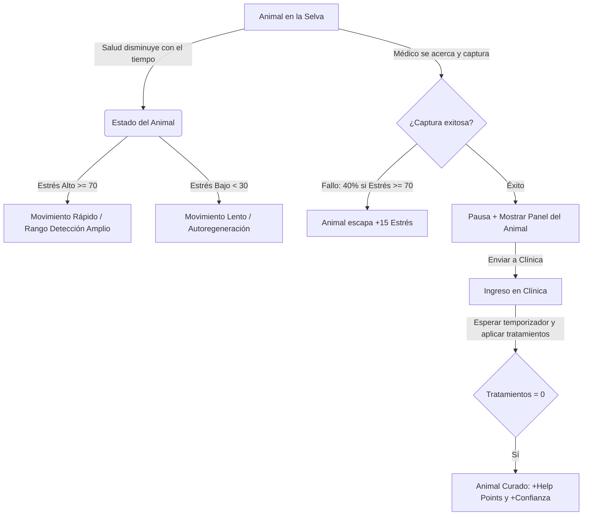

# Documentación de Lógica y Guía del Tutorial - AmazonCrisis2D

Este documento resume la lógica de juego actual basada en los scripts del proyecto y presenta propuestas concretas para integrar el análisis de audio por FFT (emociones del jugador) con las mecánicas principales.

---

## 1. Personajes y Roles Principales

- **Doctor MORI (Jugador)**: Es un veterinario situado en la selva amazónica. Su misión es encontrar animales heridos o enfermos en el mapa, capturarlos de manera segura y llevarlos a su clínica para curarlos mediante tratamientos periódicos.
- **Animales Salvajes**: Se desplazan por la selva. Tienen barras de salud visibles que se desgastan con el tiempo. Sufren de tres afecciones principales:
  1. Deshidratación
  2. Fracturas
  3. Infección

---

## 2. Lógica del Sistema de Juego (Game Loop)

El ciclo de juego se divide en tres fases principales: **Detección y Búsqueda**, **Captura** y **Tratamiento Clínico**.

### A. Mecánica de Salud ([HealthAnimals](file:///c:/UnityProjects/AmazonCrisis2D/Assets/Scripts/Gameplay/Animals/HealthAnimals.cs))
- La salud máxima es de **100 puntos** y disminuye de forma continua por segundo basándose en un temporizador de muerte (`timeToDie`, por defecto 300 segundos o 5 minutos).
- **Desgaste por Estrés**: La velocidad con la que disminuye la salud (`healthDecayPerSecond`) se multiplica según el nivel de estrés del animal:
  - **Estrés Alto (>= 70)**: Se multiplica por **1.8x** (el animal pierde vida casi el doble de rápido).
  - **Estrés Bajo (< 30)**: Se multiplica por **0.3x** (el desgaste se ralentiza significativamente) y, además, si está en libertad, el animal recupera **1.5 HP/segundo**.
- **Muerte**: Si la salud llega a 0, el animal muere, lo cual activa una penalización de confianza al jugador.

### B. Mecánica de Estrés ([AnimalStress](file:///c:/UnityProjects/AmazonCrisis2D/Assets/Scripts/Gameplay/Animals/AnimalStress.cs))
- El estrés va de **0 a 100 puntos** (comienza en **50** de forma predeterminada).
- **Incremento Natural**: Aumenta automáticamente con el tiempo a un ritmo de `stressIncreaseRate` (**3 puntos por segundo**).
- **Efectos de los Niveles de Estrés**:
  - **Estrés Alto (>= 70)**: 
    - El animal corre **1.6x** más rápido y salta **1.4x** más alto.
    - Su rango de detección del jugador se amplía **1.8x** ([AnimalSensor](file:///c:/UnityProjects/AmazonCrisis2D/Assets/Scripts/Gameplay/Animals/AnimalSensor.cs)), lo que hace que detecte al doctor desde lejos y huya rápidamente.
  - **Estrés Bajo (< 30)**: 
    - El animal se calma: camina y corre más lento (**0.7x**) y su rango de alerta baja a **0.5x** (fácil de acercarse).
    - Se activa la regeneración de salud de **1.5 HP/segundo**.
  - **Rango Medio (30 a 70)**: Movimiento y comportamiento estándar del animal.

### C. Mecánica de Captura ([CatchPlayer](file:///c:/UnityProjects/AmazonCrisis2D/Assets/Scripts/Gameplay/Player/CatchPlayer.cs))
- Al estar cerca del animal, el jugador puede intentar capturarlo pulsando la tecla `R` o el botón en pantalla.
- **Probabilidad de Fallo por Estrés**: 
  - Si el estrés es **Alto (>= 70)**, hay una probabilidad de fallo del **40%** (`highStressFailChance = 0.4f`).
  - Si la captura falla, el animal realiza un salto de huida, pasa al estado `RunAway` y su estrés aumenta inmediatamente en **+15 puntos** (`stressOnFailCapture`).
  - Si la captura tiene éxito, el juego se pausa y se abre el panel informativo ([AnimalPanelUI](file:///c:/UnityProjects/AmazonCrisis2D/Assets/Scripts/Gameplay/Animals/AnimalPanelUI.cs)), que detalla la enfermedad, tratamientos requeridos, recompensas y la probabilidad de reducción de tratamientos basada en el estrés.

### D. Tratamiento Clínico ([ClinicManager](file:///c:/UnityProjects/AmazonCrisis2D/Assets/Scripts/Gameplay/Clinic/ClinicManager.cs) y [ClinicPanelUI](file:///c:/UnityProjects/AmazonCrisis2D/Assets/Scripts/Gameplay/Clinic/ClinicPanelUI.cs))
- El jugador envía al animal capturado a la clínica (capacidad máxima: **3 animales**).
- **Influencia del Estrés al Ingresar**:
  - Si el animal ingresa con **Estrés Bajo (< 30)**:
    - **70% de probabilidad** de que el total de tratamientos requeridos se reduzca a **solo 1**.
    - La recompensa en **Help Points** (Puntos de Ayuda) aumenta un **50% (1.5x)** debido a que el animal estuvo dócil y fácil de tratar.
- **Proceso de Curación**:
  - Cada enfermedad define un tiempo de espera entre tratamientos (`minutesBetweenTreatments`) y una cantidad total de tratamientos (`treatmentCount`).
  - El temporizador de curación corre en segundo plano. Cuando llega a 0, el jugador interactúa con el panel de la clínica para aplicar un tratamiento.
  - Al completar todos los tratamientos, el animal se recupera por completo, se retira de la clínica y otorga al jugador sus **Help Points** y **Puntos de Confianza**.

### E. Confianza y Vidas del Jugador ([TrustManager](file:///c:/UnityProjects/AmazonCrisis2D/Assets/Scripts/UI/HUD/TrustManager.cs) y [HealthManager](file:///c:/UnityProjects/AmazonCrisis2D/Assets/Scripts/UI/HUD/HealthManager.cs))
- El Doctor cuenta con una barra de confianza de **0 a 100 puntos** (comienza en **100**).
- Cada vez que un animal muere, la confianza disminuye en **2 puntos** (`trustLossPerMonkey`).
- Si la confianza llega a **0**:
  - Se pierde **1 Vida** (resta de `HealthManager.health`).
  - La confianza se restablece a **100**.
  - Si las vidas llegan a 0, ocurre un **Game Over**.

### F. Habilidad de Doble Salto del Personaje ([DoctorMovement](file:///c:/UnityProjects/AmazonCrisis2D/Assets/Scripts/Gameplay/Player/DoctorMovement.cs))
Para mejorar la exploración del mapa 2D y la captura de animales en ramas altas, el Doctor Mori cuenta con la habilidad de **Doble Salto**:
- El jugador puede presionar el botón de salto en el aire para realizar un segundo salto consecutivo.
- **Control de Caídas**: Si el jugador cae de un borde sin saltar, conserva el segundo salto (salto en el aire), perdiendo el primero.
- **Física Limpia**: En el momento de realizar el doble salto, la velocidad vertical se anula antes de aplicar la fuerza hacia arriba, asegurando un impulso limpio, consistente y satisfactorio independientemente de la velocidad de caída previa.

---

## 3. Integración de Emociones por FFT (Análisis de Voz) - ¡IMPLEMENTADO!

El sistema de audio ([AudioAnalyzer](file:///c:/UnityProjects/AmazonCrisis2D/Assets/Scripts/AudioSystem/FFT/AudioAnalyzer.cs)) procesa el micrófono del jugador en tiempo real y detecta cuatro estados emocionales según el nivel de volumen (RMS) y la agresión espectral:

1. **SILENCE (Silencio)**: Sin entrada de voz o volumen por debajo del umbral mínimo.
2. **NORMAL (Voz Normal)**: Hablar de manera tranquila, pausada y dulce.
3. **NERVOUS (Voz Nerviosa)**: Hablar con cierta agitación o volumen intermedio-alto.
4. **PANIC (Pánico)**: Gritos, sonidos agudos o voz muy fuerte/agresiva.

### Mecánica de Modulación de Estrés por Voz (Implementada en [AnimalStress](file:///c:/UnityProjects/AmazonCrisis2D/Assets/Scripts/Gameplay/Animals/AnimalStress.cs))
Cuando el jugador está en el rango de detección del animal (`IsPlayerNear` es verdadero en [AnimalSensor](file:///c:/UnityProjects/AmazonCrisis2D/Assets/Scripts/Gameplay/Animals/AnimalSensor.cs)), la emoción de su voz influye directamente en el estrés del animal de la siguiente manera:

- **NORMAL (Voz suave y calmada)**: **Disminuye el estrés activamente** (`-6 puntos/segundo`). Esto permite bajar el estrés del animal a menos de 30 para facilitar su captura, ralentizar su desgaste de vida, regenerarlo y obtener bonificaciones en la clínica.
- **SILENCE (Silencio)**: Mantiene el incremento natural del estrés (`+3 puntos/segundo`) causado por la incomodidad de su enfermedad.
- **NERVOUS (Voz nerviosa)**: Incrementa el estrés de forma acelerada (`+8 puntos/segundo`).
- **PANIC (Gritos o pánico)**: Dispara el estrés de manera agresiva (`+10 puntos/segundo`), asustando al animal rápidamente y haciendo que huya y sea difícil de curar.

---

## 4. Transición de Nivel en el Tutorial ([TutorialExitTrigger](file:///c:/UnityProjects/AmazonCrisis2D/Assets/Scripts/Gameplay/TutorialExitTrigger.cs))

Para finalizar el tutorial de forma interactiva cuando el jugador alcance el objetivo de Help Points:
- Un objeto de portal/salida en la escena de Tutorial permanece inactivo y oculto visualmente al inicio del nivel.
- **Activación por Puntos**: En cuanto los Help Points llegan a **100** (a través de [HelpPointsManager](file:///c:/UnityProjects/AmazonCrisis2D/Assets/Scripts/UI/HUD/HelpPointsManager.cs)), el portal se vuelve visible y activa su colisionador automáticamente.
- **Transición**: Al acercarse a él y presionar la tecla **"E"**, el script carga la escena del siguiente nivel (`Level1`).

---

## 5. Sistema de Selección de Niveles en el Menú

El flujo de niveles del juego está conectado en el menú principal a través del [LevelManager](file:///c:/UnityProjects/AmazonCrisis2D/Assets/Scripts/Progression/LevelManager.cs) y [MenuEvents](file:///c:/UnityProjects/AmazonCrisis2D/Assets/Scripts/Core/MenuEvents.cs).

### Orden de Progresión
El juego sigue la siguiente secuencia de escenas:
1. **Tutorial** (Escena: `Tutorial`)
2. **Nivel 1** (Escena: `Level1`)
3. **Nivel 2** (Escena: `Level2`)
4. **Nivel 4** (Escena: `Level3` - Nivel 3 en archivos, 4 según flujo del jugador)
5. **Final** (Escena: `Final`)

### Acceso Directo Temporal
Para pruebas y desarrollo rápido, se ha modificado el sistema para desactivar el bloqueo de niveles:
- Todos los niveles están configurados como desbloqueados (`unlocked = true`) en [LevelManager](file:///c:/UnityProjects/AmazonCrisis2D/Assets/Scripts/Progression/LevelManager.cs) por defecto.
- El script [MenuEvents](file:///c:/UnityProjects/AmazonCrisis2D/Assets/Scripts/Core/MenuEvents.cs) contiene un mapeo robusto que asocia los índices de los botones a sus respectivos nombres de escena en Unity para asegurar que se carguen correctamente al hacer clic en el menú.

---

## 6. Guía para Diseñar el Tutorial Interactivo

Para enseñar esta lógica al jugador, proponemos estructurar el tutorial en los siguientes pasos narrados por el Doctor Mori:

1. **Paso 1: Identificar y Acercarse**
   - *Diálogo*: "¡Hola! Soy el Doctor Mori. Hay un monito deshidratado allí adelante. Su barra verde muestra su salud; si se agota, perderemos su confianza. ¡Vamos a acercarnos despacio!"
   - *Objetivo*: Caminar hacia el animal.
2. **Paso 2: Explicar el Estrés y la Voz (Introducción al Micrófono)**
   - *Diálogo*: "¡Mira! Su barra de estrés (barra amarilla sobre él) está subiendo. Si llega a ser muy alta, correrá rápido y será difícil de atrapar. Háblale bonito al micrófono con un tono calmado para tranquilizarlo."
   - *Objetivo*: El jugador debe hablar de manera tranquila en su micrófono (se detecta estado `NORMAL`). El estrés del animal baja a menos de 30.
   - *Feedback Visual*: La barra de estrés brilla en verde, el animal ralentiza su paso y el sprite del HUD del doctor sonríe.
3. **Paso 3: La Captura**
   - *Diálogo*: "¡Excelente! Ahora que está calmado, su estrés es bajo. No hay riesgo de que escape al intentar atraparlo. ¡Presiona 'R' para capturarlo!"
   - *Objetivo*: Presionar `R` cerca del animal.
4. **Paso 4: Ingreso Clínico y Tratamiento**
   - *Diálogo*: "¡Lo tenemos! Al haberlo capturado calmado, obtuvimos un beneficio: ¡solo necesitará un tratamiento rápido en nuestra clínica! Llevémoslo allí."
   - *Objetivo*: Ir a la clínica, abrir el panel con `E` y presionar el botón para aplicar el tratamiento cuando el temporizador esté listo para curarlo.
5. **Paso 5: Completar el Tutorial**
   - *Diálogo*: "¡Buen trabajo! Al curarlo, recuperamos la confianza de la selva y ganamos Puntos de Ayuda. Hemos alcanzado los 100 Help Points. ¡Mira, se ha abierto el portal de salida! Acércate e interactúa con él (presionando 'E') para iniciar tu aventura."
   - *Objetivo*: Dirigirse al portal aparecido e interactuar con 'E' para cargar la escena `Level1`.

